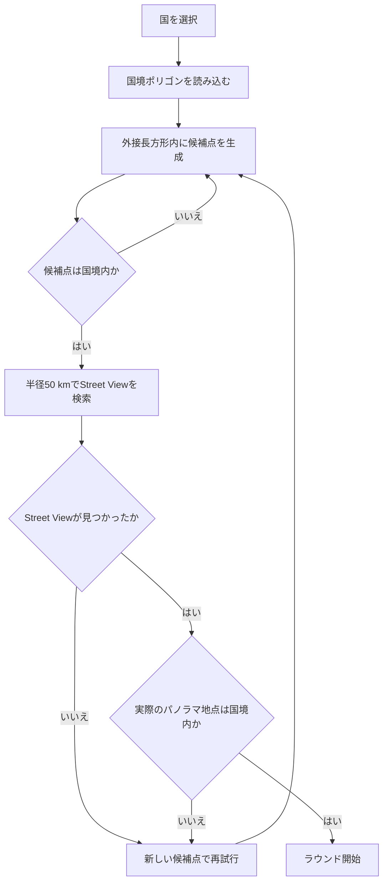

# 出題エリア選択の仕様

`index.html` に実装されている、世界全体または国を指定した場合の出題地点の決定方法をまとめます。

## 選択肢と設定

- 「世界全体」では国境データを使用せず、緯度 `-60`～`70`、経度 `-180`～`180` の範囲から検索起点を生成します。
- 国を選択した場合は、Natural Earth由来の `world-atlas` 国境データを読み込みます。
- 選択内容はフリープレイ設定として `localStorage` に保存します。
- チャレンジモードの出題エリアは常に「世界全体」です。

## 国境データの準備

選択国のGeoJSONを、単一の `Polygon` または本土・離島などからなる `MultiPolygon` として扱います。各ポリゴンについて外周を囲む緯度・経度の長方形を求め、次の値を概算の重みとして保持します。

```text
緯度幅 × 経度幅 × cos（中央緯度）
```

`cos`による補正は、高緯度ほど経度1度あたりの実距離が短くなることを考慮するためです。

## 国を指定した候補点の生成

候補点は次の棄却サンプリングで生成します。

1. 本土や離島などのポリゴンを、外接長方形の概算面積に応じて選択する。
2. 選択した外接長方形内に、緯度・経度が一様なランダム地点を作る。
3. 地点がポリゴンの外周内にあり、内側の穴には入っていないことを確認する。
4. 国境外なら破棄して再試行し、国境内ならStreet Viewの検索起点として採用する。

候補点の生成は最大500回試行します。したがって、日本の外接長方形に韓国などが含まれていても、その地点は国境判定で破棄されます。クロアチアのように外接長方形に対する国土の割合が小さい国では、隣国が出題されるのではなく、候補点の破棄回数が増えます。

## Street View地点の検索と再検証

候補点を中心として、半径50 km以内にある最寄りのStreet Viewを検索します。

- 世界全体では最大120回検索します。
- 国指定では最大240回検索します。
- 「公式画像のみ」が有効な場合はGoogle公式のパノラマに限定します。

Street View APIが返す地点は検索起点そのものとは限りません。このため、国指定時は返却された実際のパノラマ座標についても国境内か再確認します。国外ならその結果を破棄し、新しい候補点から検索し直します。



## 得点計算のエリアサイズ

世界全体では固定値 `14916.862 km` を地図サイズとして使用します。国指定では、国境全体を囲む範囲の対角線距離を地図サイズとして使用します。日付変更線をまたぐ国については、経度の最大空白区間を除いた最短の経度範囲を求めます。

得点は、正解地点との距離とこの地図サイズから計算します。

```text
round(5000 × exp(-10 × 距離km ÷ 地図サイズkm))
```

## 制約と例外

- サンプリングは厳密な球面上の一様分布ではなく、緯度・経度と概算面積を使った近似です。
- 細長い国、島が多い国、外接長方形に対する国土面積が小さい国では再試行が増えます。
- 国境判定は使用している国境データの精度に依存します。係争地域、細かな海岸線、Street View側の座標誤差などにより、現実の認識と一致しない可能性があります。

## 実装との対応

| 処理 | `index.html` の関数・定数 |
| --- | --- |
| 選択可能な国 | `COVERED_COUNTRIES`, `populateCountrySelect` |
| 国境データの取得・変換 | `loadCountryGeometry`, `geometryPolygons` |
| 外接長方形と領域の重み | `polygonBounds`, `loadCountryGeometry` |
| 国境内判定 | `pointInRing`, `pointInPolygon`, `pointInCountry` |
| 候補点の生成 | `randomCountryPoint`, `randomLatLng` |
| Street View検索と返却地点の再検証 | `findRandomPano` |
| 得点用エリアサイズ | `countryMapSizeKm`, `calculateScore` |

これらの処理、検索半径、試行回数または得点基準を変更した場合は、この資料も同時に更新してください。
